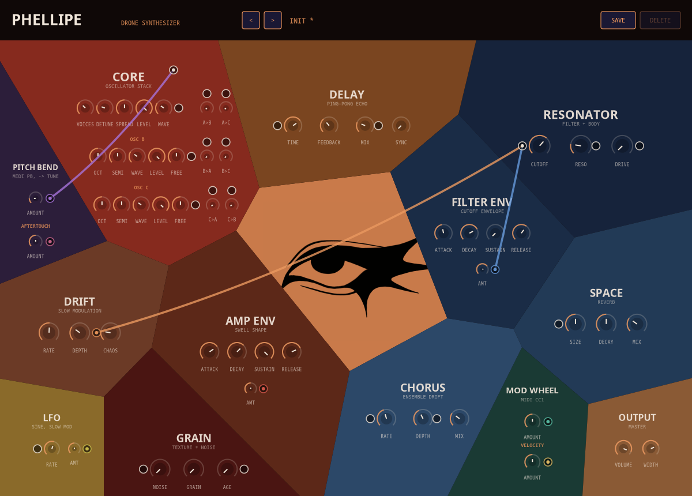

# Phellipe

An 8-voice polyphonic drone synth: three independently-tunable unison
oscillator stacks (each its own sine-to-saw WAVE blend and its own output
LEVEL, so any group can be muted from the mix while still modulating the
others) cross-modulate each other through a full 6-way FM matrix, then pass
through a resonant filter, a noise/stutter/tape-age texture layer, chorus,
a tempo-syncable ping-pong delay, and an algorithmic reverb.

A semi-modular patch-cable matrix sits underneath: DRIFT, AMP ENV, FILTER
ENV, LFO, MOD WHEEL, PITCH BEND, VELOCITY, and AFTERTOUCH can each be
patched (with their own output attenuator) into pitch, filter cutoff/
resonance/drive, wave blend, delay time/mix, chorus rate/depth, the LFO's
own rate, grain age/noise, reverb size, either sub-oscillator's fine-tune,
or any of the 6 oscillator-to-oscillator FM amounts - 8 sources x 21
destinations, drawn as hanging cables that glow brighter with their live
signal level.

Built on [DPF](https://github.com/DISTRHO/DPF) (vendored under `dpf/`), with
a custom Cairo UI: a real bounded Voronoi tessellation divides the window
into module panels (CORE, RESONATOR, DRIFT, GRAIN, SPACE, OUTPUT, AMP ENV,
FILTER ENV, DELAY, CHORUS, LFO, MOD WHEEL, PITCH BEND) around a central
hand-drawn eye, overlaid with a retro pixelated oscilloscope (pride-flag
gradient bars) that lights up while audio is playing.



## Build

```
./install.sh
```

Builds VST3, LV2, and CLAP and installs them into `~/.vst3`, `~/.lv2`,
`~/.clap`. Pass `--vst3` / `--lv2` / `--clap` to install a subset. The JACK
standalone binary lands at `build/bin/phellipe` (not installed anywhere,
run directly).

Built plugins land in `build/bin/` - `phellipe.vst3`, `phellipe.lv2`,
`phellipe.clap`, and the standalone `phellipe` binary.

## Presets

Stored as plain-text `.phlpreset` files in `~/.local/share/phellipe/presets`
(Linux). 19 factory presets are seeded there the first time the UI runs with
an empty library, several built specifically to showcase patch-matrix and
FM-matrix idioms - self-feedback LFOs, envelope-driven filter sweeps,
oscillator cross-modulation, velocity/aftertouch expression.
